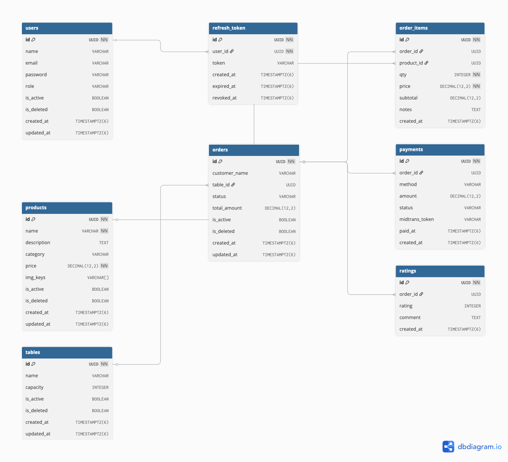

<div align="center">

<h1>API Josjis Open Source</h1>

<p>This project is intended as an implementation using the Express.js framework, following industry standards through a modular architecture approach.</p>

[](#) [](#) [](#) [](#) [](#) [](#) [](#) [](#) [](#) [](#) 

<br/>

[Live Demo](https://josjis-fnb.rafn.tech/) · [Documentation](https://docs.<PROJECT_NAME>.dev) · [Report Bug](https://github.com/lusidamhsunesa/josjis-backend/issues/new?template=bug_report.md)

</div>

---

## Overview

> **JosJis API** is <DESCRIPTION>. Built for developers who value speed, simplicity, and great developer experience.

Whether you're building a small side project or a large-scale production application, **JosJis API** gives you the tools to ship faster without compromising quality.

---

## ✨ Features

- 🚀 **Blazing Fast** — Optimized for performance with redis caching
- 🔒 **Secure by Default** — Security with validation input
- 🎨 **Fully Customizable** — Flexible configuration to fit your workflow
- 📦 **Zero Config** — Works out of the box with sensible defaults
- 🧪 **Well Tested** — Comprehensive test coverage with postman test

---

## 🛠️ Tech Stack

| Category       | Technology                                                                                           |
| -------------- | ---------------------------------------------------------------------------------------------------- |
| **Framework**  | [Express.Js](https://nextjs.org)                                                                     |
| **Language**   | [JavaScript](https://www.typescriptlang.org)                                                         |
| **Database**   | [PostgreSQL](https://www.postgresql.org) via [Supabase](https://supabase.com)                        |
| **Auth**       | [JWT](https://www.jwt.io)                                                                            |
| **ORM**        | [Prisma](https://www.prisma.io)                                                                      |
| **Deployment** | [Vercel](https://vercel.com)                                                                         |
| **Testing**    | [Postman Script](https://learning.postman.com/docs/tests-and-scripts/write-scripts/intro-to-scripts) |

<!-- Customize this table to match your actual stack -->

---

# 🗄️ Database Scheme

Below is the database structure used in this project:

<div style="border: 2px solid #ddd; padding: 10px; border-radius: 8px;">



</div>

---

## 📋 Prerequisites

Before you begin, ensure you have the following installed:

- [Node.js](https://nodejs.org) `>= 20.19.6`
- [npm](https://www.npmjs.com) `>= 10.8.2` (recommended) or yarn
- [Git](https://git-scm.com) `>=2.53.0`

---

## 🚀 Installation

### 1. Clone the repository

```bash
git clone https://github.com/lusidamhsunesa/josjis-backend
cd josjis-backend
```

### 2. Install dependencies

```bash
npm install
# or
yarn install
```

### 3. Set up environment variables

```bash
cp .env.example .env
```

Then edit `.env` with your values. See [Environment Variables](#-environment-variables) for details.

### 4. Set up the database

```bash
npx prisma migrate
```

### 5. Start the development server

```bash
npm run dev
```

Open [http://localhost:3000](http://localhost:3000) in your browser.

---

## 🔑 Environment Variables

Create a `.env` file in the root directory. Required variables:

```env
# Server Configuration
PORT=3000
NODE_ENV="dev"

# JWT Configuration
JWT_SECRET="your_jwt_secret_key"

# Cookie Configuration in hours
ACCESS_TOKEN_EXPIRES_IN=1
REFRESH_TOKEN_EXPIRES_IN=168 # 7 days
GUEST_ID_EXPIRES_IN=720 # 30 days
ADMIN_TOKEN_EXPIRES_IN=1

# Database connection URL
DATABASE_URL="your_database_url_here"
DIRECT_URL="your_direct_database_url_here"

# Redis Configuration
REDIS_HOST="your_redis_host_here"
REDIS_PORT=16326
REDIS_USERNAME="your_redis_username_here"
REDIS_PASSWORD="your_redis_password_here"
REDIS_ENABLED=false
REDIS_CACHE_TTL=60

# Ratelimit Configuration
RATE_LIMIT_WINDOW=10
RATE_LIMIT_MAX=100

# CORS Configuration
CORS_ORIGIN="*"

# S3 Configuration
S3_ENDPOINT=your_s3_endpoint_here
S3_REGION=your_s3_region_here
S3_ACCESS_KEY=your_s3_access_key_here
S3_SECRET_KEY=your_s3_secret_key_here
S3_BUCKET=your_s3_bucket_name_here

PUBLIC_URL=your_public_url_here

# Image Processing Configuration
IMAGE_MAX_SIZE=200 # in KB
IMAGE_QUALITY=80
IMAGE_UPLOAD_SIZE_LIMIT=3 # in MB

# Admin Credentials
ADMIN_NAME="Admin"
ADMIN_EMAIL="admin@example.com"
ADMIN_PASSWORD="admin_password_here"

# Midtrans Configuration
MIDTRANS_SERVER_KEY=your_midtrans_server_key_here
MIDTRANS_WEBSITE_ID=your_midtrans_website_id_here
```

> [!NOTE]
> Never commit `.env` to version control. The `.env.example` file is provided as a safe template.

| Variable                   | Required | Description                                                            |
| -------------------------- | -------- | ---------------------------------------------------------------------- |
| `PORT`                     | ✅       | Port where the application runs                                        |
| `NODE_ENV`                 | ✅       | Environment mode (dev / production)                                    |
| `JWT_SECRET`               | ✅       | Secret key for signing JWT tokens                                      |
| `ACCESS_TOKEN_EXPIRES_IN`  | ✅       | Expiration time for access token                                       |
| `REFRESH_TOKEN_EXPIRES_IN` | ✅       | Expiration time for refresh token                                      |
| `GUEST_ID_EXPIRES_IN`      | ✅       | Expiration time for guest session/ID                                   |
| `ADMIN_TOKEN_EXPIRES_IN`   | ✅       | Expiration time for admin token                                        |
| `DATABASE_URL`             | ✅       | Primary database connection string (e.g. PostgreSQL)                   |
| `DIRECT_URL`               | ✅       | Direct database connection (used for migrations)                       |
| `REDIS_HOST`               | ✅       | Redis server host                                                      |
| `REDIS_PORT`               | ✅       | Redis server port                                                      |
| `REDIS_USERNAME`           | ✅       | Redis authentication username (if enabled)                             |
| `REDIS_PASSWORD`           | ✅       | Redis authentication password                                          |
| `REDIS_ENABLED`            | ✅       | Enable or disable Redis caching                                        |
| `REDIS_CACHE_TTL`          | ✅       | Cache time-to-live in seconds                                          |
| `RATE_LIMIT_WINDOW`        | ✅       | Time window for rate limiting (in seconds/ms depending implementation) |
| `RATE_LIMIT_MAX`           | ✅       | Maximum requests allowed per window                                    |
| `CORS_ORIGIN`              | ✅       | Allowed origins for CORS policy                                        |
| `S3_ENDPOINT`              | ✅       | S3-compatible storage endpoint URL                                     |
| `S3_REGION`                | ✅       | S3 storage region                                                      |
| `S3_ACCESS_KEY`            | ✅       | Access key for S3 storage                                              |
| `S3_SECRET_KEY`            | ✅       | Secret key for S3 storage                                              |
| `S3_BUCKET`                | ✅       | Bucket name for file storage                                           |
| `PUBLIC_URL`               | ✅       | Public base URL of the application                                     |
| `IMAGE_MAX_SIZE`           | ✅       | Maximum image size allowed (bytes)                                     |
| `IMAGE_QUALITY`            | ✅       | Image compression quality (0–100)                                      |
| `IMAGE_UPLOAD_SIZE_LIMIT`  | ✅       | Upload size limit for images (bytes)                                   |
| `ADMIN_NAME`               | ✅       | Default admin user name                                                |
| `ADMIN_EMAIL`              | ✅       | Default admin email address                                            |
| `ADMIN_PASSWORD`           | ✅       | Default admin password (should be secured)                             |
| `MIDTRANS_SERVER_KEY`      | ✅       | Server key for Midtrans payment gateway                                |
| `MIDTRANS_WEBSITE_ID`      | ✅       | Merchant/website identifier for Midtrans                               |

---

## 📁 Project Structure

```bash
josjis-backend/
├── prisma                    # Prisma ORM folder
│   ├── schema.prisma
│   └── seed.js
├── resource                  # Resource folder
│   ├── API_JosJis_v1.postman_collection.json
│   ├── db.sql
│   ├── web_socket_events.png
│   └── web_socket_message.png
├── src                       # Main folder
│   ├── config                # Config folder
│   │   ├── admin.credential.js
│   │   ├── cookiesDuration.config.js
│   │   ├── db.config.js
│   │   ├── env.check.js
│   │   ├── logger.config.js
│   │   ├── redis.config.js
│   │   ├── s3.config.js
│   │   ├── sharp.config.js
│   │   └── socket.config.js
│   ├── middlewares           # Middlewares folder
│   │   ├── auth.middleware.js
│   │   ├── authRole.middleware.js
│   │   ├── cache.middleware.js
│   │   ├── cors.js
│   │   ├── handleUpdloadError.js
│   │   ├── logger.js
│   │   ├── rate.limiter.js
│   │   └── upload.middleware.js
│   ├── modules               # Modules folder app
│   │   ├── auth              # Auth Module
│   │   │   ├── auth.controller.js
│   │   │   ├── auth.repository.js
│   │   │   ├── auth.route.js
│   │   │   ├── auth.service.js
│   │   │   └── auth.validation.js
│   │   ├── order             # Order Module
│   │   │   ├── order.controller.js
│   │   │   ├── order.repository.js
│   │   │   ├── order.route.js
│   │   │   ├── order.service.js
│   │   │   └── order.validation.js
│   │   ├── payment           # Payment Module
│   │   │   ├── payment.controller.js
│   │   │   ├── payment.repository.js
│   │   │   ├── payment.route.js
│   │   │   ├── payment.service.js
│   │   │   └── payment.validation.js
│   │   ├── products          # Product Module
│   │   │   ├── products.controller.js
│   │   │   ├── products.dto.js
│   │   │   ├── products.repository.js
│   │   │   ├── products.route.js
│   │   │   ├── products.service.js
│   │   │   └── products.validation.js
│   │   ├── rating            # Rating Module
│   │   │   ├── rating.controller.js
│   │   │   ├── rating.repository.js
│   │   │   ├── rating.route.js
│   │   │   ├── rating.service.js
│   │   │   └── rating.validation.js
│   │   ├── table             # Table Module
│   │   │   ├── table.controller.js
│   │   │   ├── table.repository.js
│   │   │   ├── table.route.js
│   │   │   ├── table.service.js
│   │   │   └── table.validation.js
│   │   └── webhook           # Webhook Module
│   │       ├── webhook.controller.js
│   │       ├── webhook.repository.js
│   │       ├── webhook.route.js
│   │       └── webhook.service.js
│   ├── utils                 # Ulits Folder
│   │   ├── cache.js
│   │   ├── cookies.js
│   │   ├── jwt.js
│   │   ├── midtrans.token.js
│   │   ├── response.js
│   │   └── s3.js
│   ├── app.js                # App load
│   └── server.js             # Server Listen
├── package-lock.json
├── package.json
└── README.md
```

---

## 📜 Scripts

| Command                    | Description                         |
| -------------------------- | ----------------------------------- |
| `npm run dev`              | Start development server            |
| `npm run start`            | Start production server             |
| `npx prisma migrate dev`   | Run new migration                   |
| `npx prisma migrate`       | Apply migration                     |
| `npx prisma migrate reset` | Reset database                      |
| `npx prisma studio`        | Launch Prisma Studio (database GUI) |

---

## 🔌 API Reference

> [!TIP]
> Full API documentation is available at [API Documentation](https://github.com/lusidamhsunesa/josjis-backend/blob/master/resource/API_JosJis_v1.postman_collection.json)

### Authentication

All Protected API routes require a access_token:

```javascript
headers: {
      'Cookie': 'access_token=your_access_token'
   }
```

#### Admin login

POST /api/auth/admin/login

```json
{
  "email": "admin@example.com",
  "password": "admin_password_here"
}
```

#### Admin endpoint (Protected)

1. Get Admin 🔒 : GET /api/auth/admin/me

   ```javascript
   headers: {
      'Cookie': 'access_token=your_access_token'
   }
   ```

2. Get Admin Refresh Token : GET /api/auth/admin/refresh-token

   ```javascript
   headers: {
      'Cookie': 'refresh_token=your_refresh_token'
   }
   ```

3. Logout Admin : POST /api/auth/admin/logout

   ```javascript
   headers: {
      'Cookie': 'access_token=your_access_token'
   }
   ```

## 🚀 API Routes

### 🔐 Auth (Admin)

| Method                                                                 | Endpoint                        | Protected | Role  |
| ---------------------------------------------------------------------- | ------------------------------- | --------- | ----- |
|  | `/api/auth/admin/login`         | ✅        | admin |
|       | `/api/auth/admin/me`            | ✅        | admin |
|       | `/api/auth/admin/refresh-token` | ✅        | admin |
|  | `/api/auth/admin/logout`        | ✅        | admin |

---

### 📦 Products

| Method                                                                 | Endpoint            | Protected | Role        |
| ---------------------------------------------------------------------- | ------------------- | --------- | ----------- |
|  | `/api/products`     | ✅        | admin       |
|       | `/api/products`     | ❌        | admin, user |
|       | `/api/products/:id` | ❌        | admin, user |
|     | `/api/products/:id` | ✅        | admin       |
|  | `/api/products`     | ✅        | admin       |

---

### 🧾 Orders

| Method                                                                 | Endpoint          | Protected | Role        |
| ---------------------------------------------------------------------- | ----------------- | --------- | ----------- |
|  | `/api/orders`     | ❌        | user        |
|       | `/api/orders`     | ✅        | admin       |
|       | `/api/orders/:id` | ❌        | admin, user |
|     | `/api/orders/:id` | ✅        | admin       |
|  | `/api/orders`     | ✅        | admin       |

---

### 💳 Payments

| Method                                                                 | Endpoint            | Protected | Role  |
| ---------------------------------------------------------------------- | ------------------- | --------- | ----- |
|  | `/api/payments`     | ❌        | user  |
|       | `/api/payments`     | ✅        | admin |
|     | `/api/payments/:id` | ✅        | admin |
|  | `/api/payments`     | ✅        | admin |

---

### ⭐ Ratings

| Method                                                                 | Endpoint                      | Protected | Role        |
| ---------------------------------------------------------------------- | ----------------------------- | --------- | ----------- |
|  | `/api/ratings`                | ❌        | user        |
|       | `/api/ratings`                | ✅        | admin       |
|       | `/api/ratings/order/:orderId` | ✅        | admin, user |
|     | `/api/ratings/:id`            | ✅        | user        |

---

### 🪑 Tables

| Method                                                                 | Endpoint          | Protected | Role        |
| ---------------------------------------------------------------------- | ----------------- | --------- | ----------- |
|  | `/api/tables`     | ✅        | admin       |
|       | `/api/tables`     | ❌        | admin, user |
|     | `/api/tables/:id` | ✅        | admin       |
|  | `/api/tables`     | ✅        | admin       |

---

## 👤 Author

**<AUTHOR>**

- Website: [rafn.tech](https://rafn.tech)
- GitHub: [@bluesky4047](https://github.com/bluesky4047)
- Email: [developer@rafn.tech](mailto:developer@rafn.tech)

---

## 🙏 Acknowledgements

- [Express.js](https://expressjs.com/en) — The Javascript framework for production
- [Supabase](https://supabase.com) — The open source Firebase alternative
- [Vercel](https://vercel.com) — Platform for frontend frameworks
- [Shields.io](https://shields.io) — Quality metadata badges

---

## 💬 Support

If you found this project helpful, please consider:

- ⭐ **Starring** this repository
- 🐛 **Reporting bugs** via [GitHub Issues](https://github.com/lusidamhsunesa/josjis-backend/issues)
- 💡 **Suggesting features** via [GitHub Discussions](https://github.com/lusidamhsunesa/josjis-backend/discussions)
- ☕ **Sponsoring** the project on [GitHub Sponsors](https://github.com/sponsors/lusidamhsunesa)

<div align="center">

---

Made with ❤️ by [Josjis Development Team](https://github.com/lusidamhsunesa)

</div>
